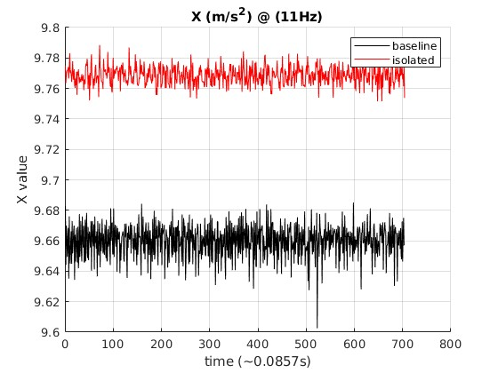
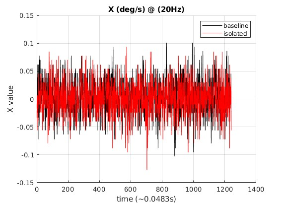

<div align="center">
<h1> Using the Hololens 2 Sensors </h1> 
</div>

## Putting Hololens in Research Mode ##

Before doing any work, make sure the device is in research mode so that access to the sensor streams is permitted. The tutorial for doing this can be found here: https://learn.microsoft.com/en-us/windows/mixed-reality/develop/advanced-concepts/research-mode

<br/>

## Relevant Inputs and Outputs ##

| Group | Sensor | Input | Output |
| :-----------: | :---: | :---: | :---: | 
| Head Tracking | 4 Visible Light Cameras (VLCs) | 400nm - 700nm wavelength light | 640x480 @ 30 FPS, Grayscale, H264 or HEVC encoded
| Depth | 1MP ToF Depth Camera| Time of Flight between camera and object | AHAT (512x512 @ 45 FPS, 16-bit Depth + 16-bit AB as NV12 luma+chroma, H264 or HEVC encoded) <br/> <br/> Long Throw (320x288 @ 5 FPS, 16-bit Depth + 16-bit AB, encoded as a single 32-bit PNG)
| 9 DOF IMU | Accelerometer<br/> Gyroscope <br/> Magnetometer | Linear Acceleration <br/> Angular Velocity  <br/> Magnetic Field | (m/s^2) measurement <br/> (deg/s) measurement <br/> (T) measurement <br/> Pose Frame
| Front Camera  | 8MP VLC | 400nm - 700nm wavelength light | 1920x1080 @ 30 FPS, RGB, H264 or HEVC encoded

<br>


## CV for Hololens 2 ##
To make use of the equipped sensors, Visual Studio and the Hololens2ForCV repo by Microsoft must be used: https://github.com/microsoft/HoloLens2ForCV

If 3D assets or overlays are to be used in a project, this repo can also be converted into Unity: https://github.com/petergu684/HoloLens2-ResearchMode-Unity

<br>

## hl2ss ##

With the CV for Hololens 2 repo, Python is required to post-process the raw data into human viewable data. For more direct access into the available sensor streams, consider using the following: https://github.com/jdibenes/hl2ss 

<br/>

This repo contains a server and client app with the former hosted on the Hololens and the latter hosted on a Linux machine of choice (likely compatible with MacOS and WSL). There is also a Unity plugin for this repo. The sensor streams are accessed via ip adress assuming the Hololens and the client machine are on the same network. Configuring the client and server app to the same IP address simply requires the change follwing line in all scripts: 

```
# HoloLens address
host = "123.45.678.9"
```

Changing this line to the IPV4 address displayed in Hololens settings or the the IP address displayed when wearing the device while the server app is running will allow this to work.

<br/>

## Data Collection and Analysis ##

### IMU ###

Modifying and using the python imu viewer of hl2ss (https://github.com/jdibenes/hl2ss/blob/main/viewer/client_rm_imu.py) will output the desired IMU sensor into the terminal of the client  machine. Multiple sensors can be accessed at once but can disrupt the consistency of the sample rates.


<br/>

Editing the following line:

```
print('Got {count} samples at time {data.timestamp}, first sample is (ticks = {sample.vinyl_hup_ticks} | {sample.soc_ticks}, x = {sample.x}, y = {sample.y}, z = {sample.z}, temperature={sample.temperature})')
```

into 

```
print(sample.x,',',sample.y,',',sample.z,',',sample.temperature)
```
will print the comma separated IMU measurements directly into the terminal of the client machine which can then be directly piped into a .csv for analysis via the  &nbsp; `>>`  &nbsp; operator in bash. A sample bash command to pipe the output into a .csv would be: 

```
python3 client_rm_imu.py >> filename.csv
```

Using Matlab, analysis was done using a dataset of the acclerometer and gyroscope readings over a duration of ~60 seconds while the Hololens was placed on a flat surface with the goggles down. 3 graphs were produced for each sensor. One line is a baseline reading on a regular worktable and the other line is reference reading since the device was put on a vibration isolation table. 

<div align="center">

<br/>
<br/>



Accel X
<br/>
<br/>


Accel Y
<br/>
<br/>


Accel Z
<br/>
<br/>



Gyro X
<br/>
<br/>


Gyro Y
<br/>
<br/>


Gyro Z
<br/>
<br/>

</div>

With the isolated reading, the amplitude of the noise is hardly reduced or not reduced at all. It also seems that the 11Hz and 20 Hz sample rate is a hardware limit for the accelerometer and gyroscope respectively. Considering that commericial IMU modules (MPU6050, LSM9DS1, etc.) can easily be sampled at 100 Hz or greater, the device may not be the best for GPS/INS solutions. No Magnetometer readings were taken because of its very low 1 Hz sample rate. Further research into possibly sampling the IMU sensors is needed. 

### Cameras ###

The viewer folder of hl2ss also contains scripts for outputting the video streams to a display window on the client machine. These scripts can be modified to use existing vision libraries to analyze the video in real time. Below are some example video outputs:
